# 1. Datenbeschreibung
- **Beobachtungen**: 50
- **Variablen**:
  - **sr**: Sparquote (Prozentsatz des verfügbaren Einkommens, das gespart wird)
  - **pop15**: Prozentanteil der Bevölkerung unter 15 Jahren
  - **pop75**: Prozentanteil der Bevölkerung über 75 Jahren
  - **dpi**: Reales Pro-Kopf-Verfügbares Einkommen
  - **ddpi**: Wachstumsrate des realen Pro-Kopf-Verfügbaren Einkommens

# 2. Packages und Daten


```python=
import pandas as pd, numpy as np
import scipy as sp, seaborn as sns
import matplotlib.pyplot as plt
import statsmodels.api as sm
import statsmodels.formula.api as smf
import faraway.utils
```


```python=
import faraway.datasets.savings
savings = faraway.datasets.savings.load()
savings.head()
```

<table class="dataframe">
  <thead>
    <tr style="text-align: right;">
      <th></th>
      <th>sr</th>
      <th>pop15</th>
      <th>pop75</th>
      <th>dpi</th>
      <th>ddpi</th>
    </tr>
  </thead>
  <tbody>
    <tr>
      <th>Australia</th>
      <td>11.43</td>
      <td>29.35</td>
      <td>2.87</td>
      <td>2329.68</td>
      <td>2.87</td>
    </tr>
    <tr>
      <th>Austria</th>
      <td>12.07</td>
      <td>23.32</td>
      <td>4.41</td>
      <td>1507.99</td>
      <td>3.93</td>
    </tr>
    <tr>
      <th>Belgium</th>
      <td>13.17</td>
      <td>23.80</td>
      <td>4.43</td>
      <td>2108.47</td>
      <td>3.82</td>
    </tr>
    <tr>
      <th>Bolivia</th>
      <td>5.75</td>
      <td>41.89</td>
      <td>1.67</td>
      <td>189.13</td>
      <td>0.22</td>
    </tr>
    <tr>
      <th>Brazil</th>
      <td>12.88</td>
      <td>42.19</td>
      <td>0.83</td>
      <td>728.47</td>
      <td>4.56</td>
    </tr>
  </tbody>
</table>


# 3. Lineare Regression

```python=
lmod = smf.ols('sr ~ pop15 + pop75 + dpi + ddpi', savings).fit()
```

# 4. Diagnosis
### Fehler und Modellannahmen

- **Fehler:** $ε \sim N(0,σ^2 I)$
- **Modell:** $\mathbb{E}(y)=Xβ$

### Ungewöhnliche Beobachtungen

- Einige Beobachtungen passen nicht ins Modell.
- Diese können die Wahl und Anpassung des Modells beeinflussen.

### Diagnosetechniken

- **Grafische Techniken:**
  - Flexibel, aber schwerer zu interpretieren.
  - Visuelle Darstellung der Daten.

- **Numerische Techniken:**
  - Weniger flexibel, aber präziser und objektiver.
  - Statistische Analysen und Berechnungen.

### Modellentwicklung

- **Iterativer Prozess:**
  - Erstes Modell oft unzureichend.
  - Regression Diagnostics helfen bei der Verbesserung.
  - Änderungen basierend auf Diagnoseergebnissen wiederholen, bis ein zufriedenstellendes Modell gefunden ist.

### Fehleranalyse

- **Residuen**
  - Beobachtbare Residuen $\hat{ε}$ statt nicht beobachtbarer Fehler $ε$.
  - $\hat{ε} = y - \hat{y} = (I-H)y = (I-H)ε -> var(\hat{ε}) = var[(I-H)ε] = (I-H)σ^2$.
  - Annahme: $var(ε) = σ^2 I$.

- **Unabhängigkeit der Fehler**
  - Fehler sollten sich nicht gegenseitig beeinflussen.

- **Konstante Varianz**
  - Fehlerstreuung bleibt über verschiedene Werte der unabhängigen Variablen konstant.

- **Normalität der Fehler**
  - Fehler folgen einer Normalverteilung.
  - Wichtig für statistische Tests und Modelle.
  - Abweichungen können die Gültigkeit der Analyse beeinträchtigen.

- **Residuen vs. Fehler**
  - Fehler $ε$ können gleiche Varianz und keine Korrelation haben.
  - Residuen $\hat{ε}$ haben diese Eigenschaften nicht, aber Diagnosen können dennoch angewendet werden.

### 4.1.1. Konstante Varianz

- **Überprüfung der Annahme**
  - Residuen allein sind nicht ausreichend.
  - Variabilität der Residuen muss auf andere Faktoren geprüft werden.

- **Diagnosewerkzeug: Plot von $\hat{ε}$ gegen $\hat{y}$**
  - **Homoskedastizität**: Konsistentes und symmetrisches Muster in der Vertikalen ($\hat{ε}$).
  - **Heteroskedastizität**: Inkonsistentes oder unsymmetrisches Muster.
  - **Nichtlinearität**: Gekrümmtes oder nicht-lineares Muster zeigt mögliche Modellfehler.


```python=
plt.scatter(lmod.fittedvalues, lmod.resid)
plt.ylabel("Residuals"); plt.xlabel("Fitted values"); plt.axhline(0);
```
    
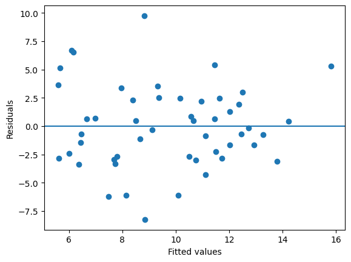
    
- **Konstante Varianz überprüfen**
  - Kein Grund zur Besorgnis im Plot.
  - Für genauere Prüfung: $\sqrt{|\hat{ε}|}$ gegen $\hat{y}$ plotten.

```python=
plt.scatter(lmod.fittedvalues, np.sqrt(abs(lmod.resid)))
plt.ylabel(r'$\sqrt{|\hat{ε}|}$'); plt.xlabel("Fitted values");
```
    
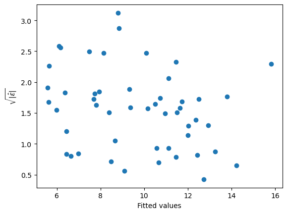

- **Numerischer Test auf nicht-konstante Varianz**
  - Regression durchführen, um zu prüfen, ob sich die Größe von ${|\hat{ε}|}$ mit den angepassten Werten ändert.

```python=
ddf = pd.DataFrame({'x':lmod.fittedvalues, 'y':np.sqrt(abs(lmod.resid))})
dmod = smf.ols('y ~ x', ddf).fit()
dmod.sumary()
```

               coefs stderr tvalues pvalues
    Intercept  2.162  0.348    6.22  0.0000
    x         -0.061  0.035   -1.77  0.0838    
    n=50 p=2 Residual SD=0.634 R-squared=0.06

- **Test auf nicht-konstante Varianz**
  - Gewichtung und Anpassung der Freiheitsgrade nötig.
  - Steigung nicht signifikant, daher keine klare Varianzabweichung.
  - Testet nur lineare Trends, kann andere Arten von Varianzabweichungen übersehen.

- **Grafische Techniken**
  - Effektiver bei der Aufdeckung versteckter Muster oder Strukturen.
  - Interpretation kann unklar sein, bietet aber Sicherheit über Modellannahmen.
  - Bevorzugt für Diagnose; formale Tests zur Bestätigung von Plot-Indikationen.

- **Beispiel**
  - Residuen gegen Prädiktoren für Spardaten betrachten.

```python=
plt.scatter(savings.pop75, lmod.resid)
plt.xlabel("%pop over 75"); plt.ylabel("Residuals"); plt.axhline(0);
```
    
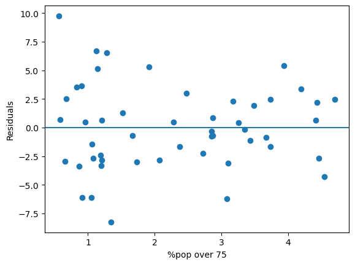

```python=
plt.scatter(savings.pop15, lmod.resid)
plt.xlabel("%pop under 15"); plt.ylabel("Residuals"); plt.axhline(0);
```

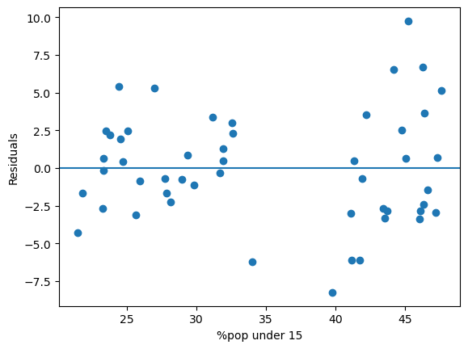

- **Gruppenvergleich im Plot**
  - Zwei Gruppen sichtbar.
  - Varianzen in diesen Gruppen vergleichen und testen.

- **Varianztest**
  - Zwei unabhängige Stichproben aus Normalverteilungen.
  - Teststatistik: Verhältnis der beiden Varianzen prüfen.

```python=
numres = lmod.resid[savings.pop15 > 35]
denres = lmod.resid[savings.pop15 < 35]
fstat = np.var(numres, ddof=1)/np.var(denres, ddof=1)
# ddof in the np.var is "Delta Degrees of Freedom."
# By default, ddof = 0, which means the divisor is N
# When ddof=1, the divisor becomes N-1. 
2*(1 - sp.stats.f.cdf(fstat, len(numres)-1, len(denres)-1))
```

    0.013575950424160377

### Modellanpassungen bei Diagnoseproblemen

- **Änderungen bei Diagnoseproblemen**
  - Anpassungen am Modell erforderlich bei Problemen in Diagnoseplots.
  - Nichtlinearität und nicht-konstante Varianz: Variablen transformieren.
  - Nur nicht-konstante Varianz: Gewichtete kleinste Quadrate oder Transformation der Antwortvariablen.

- **Transformation der Antwortvariablen**
  - **Ziel:** Konstante Varianz erreichen.
  - **Vorgehen:** Antwortvariable in Funktion $h(y)$ transformieren.
  - **Wahl von $h(y)$:** Sicherstellen, dass $var(h(y))$ konstant bleibt.
  - **Herleitung:**
    - $h(y) = h(E(y)) + [y-E(y)]\cdot h'(E(y)) + \cdots$
    - $var[h(y)] = 0 + h'(E(y))^2~var(y) + \cdots$
    - Für konstante Varianz: $h'(E(y)) \propto \sqrt{var(y)}$
    - $h(y) = \int \frac{dy}{\sqrt{var(y)}} = \int \frac{dy}{sd(y)}$

- **Beispiele für Transformationen**
  - $var(y) \propto (E(y))^2$: $h(y) = \log(y)$
  - $var(y) \propto E(y)$: $h(y) = \sqrt{y}$

- **Alternative Transformationen**
  - Schwierige Daten: Transformation wie $\log(y + δ)$ bei Werten ≤ 0.
  - Beachten: Interpretation der Ergebnisse kann komplexer werden.

### 4.1.2. Normalität

- **Annahme**
  - Tests und Konfidenzintervalle basieren auf normalverteilten Fehlern.

- **Überprüfung der Normalität**
  - **Q-Q-Plot:**
    - Sortierte Residuen gegen $Φ^{-1} (\frac{i}{n+1})$ für i = 1, …, n plotten.
    - Normale Residuen sollten der Linie ungefähr folgen.

```python=
sm.qqplot(lmod.resid, line="q");
```
    
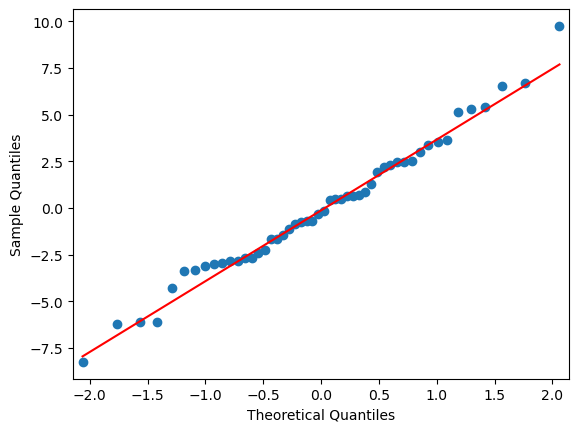

- **Normalität prüfen**
  - **Ungeeignete Methoden**
    - Histogramme und Boxplots sind wenig hilfreich.
    - Histogramme zeigen oft keine Glockenkurve wegen der Gruppierung in Bins.
    - Breite und Platzierung der Bins können das Ergebnis verfälschen.

```python=
plt.hist(lmod.resid); plt.xlabel("Residuals");
```

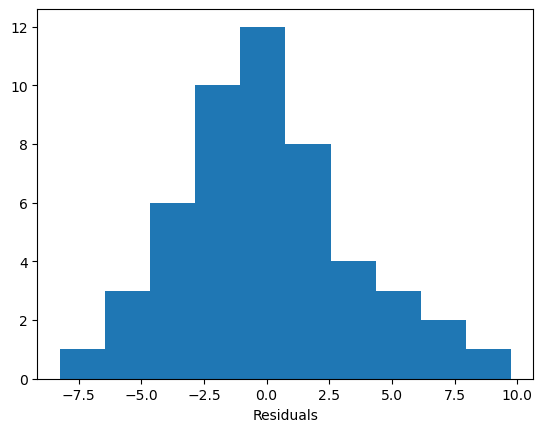

- **Q-Q-Plots**
  - **Herausforderungen**: Schwierige Identifikation von Problemen.
  - **Extreme Fälle**: Hinweis auf langschwänzige Fehler (z.B. Cauchy-Verteilung) oder Ausreißer.
  - **Entfernen von Beobachtungen**: Wenn andere Punkte auffälliger werden, wahrscheinlich langschwänziger Fehler.
- **Shapiro-Wilk-Test**
    - **Formaler Test auf Normalität**
      - **Nullhypothese**: Residuen sind normal.
      - Nicht ablehnen der Nullhypothese bedeutet mögliche Normalität.
    - **Verwendung**
      - **Mit Q-Q-Plot**: Beste Ergebnisse.
      - **Große Datensätze**: Kleine Abweichungen erkennbar, aber nicht signifikant.
      - **Kleine Datensätze**: Test erkennt Abweichungen möglicherweise nicht gut.


```python=
sp.stats.shapiro(lmod.resid)
```

    ShapiroResult(statistic=0.986984385973169, pvalue=0.8523961877568906)

- **Umgang mit Nicht-Normalität in statistischen Modellen**
    - **Effekte und Lösungen**
      - Nicht-normal verteilte Fehler: Kleinste-Quadrate-Schätzungen sind nicht optimal, aber linear und unverzerrt.
      - Robustere Schätzer könnten besser funktionieren.
      - Tests und Konfidenzintervalle werden mit größerer Stichprobe durch das zentrale Grenzwerttheorem genauer.

    - **Lösungsansätze bei Nicht-Normalität**
      - **Kurzschwänzige Verteilungen**: Geringer Einfluss, oft vernachlässigbar.
      - **Schiefe Verteilungen**: Transformation der Antwortvariable.
      - **Langschwänzige Verteilungen**: 
        - Nicht-Normalität akzeptieren und andere Verteilungen verwenden.
        - Resampling-Methoden wie Bootstrap oder Permutationstests.
        - Robuste Methoden nutzen, die Ausreißer weniger gewichten.

    - **Diagnosetests und Modellanpassungen**
      - Andere Tests können Modelländerungen erfordern.
      - Probleme wie Nichtlinearität und nicht-konstante Varianz zuerst beheben, um Nicht-Normalität zu vermeiden.

### 4.1.3. Korrigierte Fehler

- **Durbin-Watson-Test**
  - Beurteilt die Signifikanz der Korrelation in Fehlern.
  - **Nullhypothese**: Fehler sind unkorreliert.
  - **Teststatistik**:
    - $DW = \frac{\sum_{i=2}^{n}{(\hat{ε}_i - \hat{ε}_{i-1})^2} }{\sum_{i=1}^{n}{\hat{ε}_i^2}}$
    - Wert von 2 unter Nullhypothese erwartet; Wert < 1 zeigt mögliches Problem.

- **Serielle Korrelation**
  - Kann durch fehlende Kovariaten im Modell entstehen.
  - Beispiel: Quadratische Beziehung zwischen Prädiktor und Antwort, aber nur linearer Term im Modell.
  - Lösung: Fehlenden quadratischen Term ins Modell aufnehmen, um serielle Korrelation zu beheben.


```python=
sm.stats.stattools.durbin_watson(lmod.resid)
```

    1.9341492250435388

## 4.2. Ungewöhnliche Beobachtungen

- **Ausreißer**
  - Passen nicht gut ins Modell.

- **Einflussreiche Beobachtungen**
  - Beeinflussen die Modellanpassung stark.
  - Können auch Ausreißer sein.

- **Hebelpunkte**
  - Extrem in Prädiktor-Raum.
  - Potenzieller Einfluss auf die Modellanpassung.
  - Identifikation wichtig, Umgang schwierig.

### 4.2.1. Hebelwirkung

- **Hebelwerte ($h_i$)**
  - $h_i = H_{ii}$ als diagnostisches Werkzeug.
  - **Varianz:** $var(\hat{ε}_i) = \sigma^2 (1-h_i)$
    - Hohe $h_i$: $var(\hat{ε}_i)$ klein, $\hat{y}_i$ näher an $y_i$.
    - Ursachen: Extreme Werte in Prädiktorvariablen (X-Raum).
    - Zusammenhang mit quadratischer Mahalanobis-Distanz: $\left(x-\bar{x}\right)^T{\hat{\mathrm{\Sigma}}}^{-1}\left(x-\bar{x}\right)$.
    - $h_i$ hängt nur von X ab, nicht von y.
    - Durchschnitt: $\sum_i h_i = p$, Durchschnittswert $h_i = p/n$. Werte > 2p/n prüfen.

- **Identifikation großer Hebelwerte**
  - Keine Annahme über Verteilung.
  - **Halbnormal-Plot:**
    - Daten gegen positive Normalquantile plotten.
    - Halbnormal-Plot kann für $|\hat{ε}|$ verwendet werden.
    - Daten sortieren: $h_{[1]} \leq \cdots \leq h_{[n]}$.
    - Positive Normalquantile berechnen: $u_i = \Phi^{-1}\left(\frac{n+i}{2n+1}\right)$.
    - Plot: $h_{[i]}$ (x-Achse) gegen $u_i$ (y-Achse).
    - Ziel: Ausreißer identifizieren, die deutlich vom Rest abweichen.

```python=
diagv = lmod.get_influence()
hatv = pd.Series(diagv.hat_matrix_diag, savings.index)
hatv.sort_values().tail()
```

    South Rhodesia    0.160809
    Ireland           0.212236
    Japan             0.223310
    United States     0.333688
    Libya             0.531457
    dtype: float64

```python=
print(sum(hatv)); print(2*5/50) # p = 5, n = 50
```

    4.9999999999999885
    0.2

```python=
# Draw half-normal plot
n=50
ix = np.arange(1, n+1)
halfq = sp.stats.norm.ppf((n+ix)/(2*n+1)),
plt.scatter(halfq, np.sort(hatv))
plt.annotate("Libya",(2.1,0.53)); plt.annotate("USA", (1.9,0.33));
```

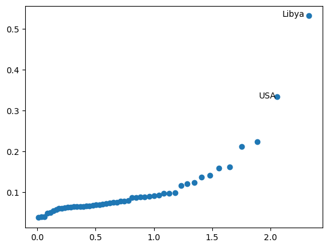

- **Standardisierte Residuen**
    - **Varianz der Residuen**: $var(\hat{ε}_i) = \sigma^2 (1-h_i)$
      - **Formel**: $r_i=\frac{{\hat{\varepsilon}}_i}{\hat{\sigma}\sqrt{1-h_i}}$
      - **Bezeichnung**: Standardisierte Residuen (Pearson-Residuen)
    - **Vorteile**
      - Bevorzugt in Residuenplots wegen angeglichener Varianz.
      - Bei korrekten Modellannahmen gilt: $var(r_i) = 1$
      - Korrelation $corr(r_i, r_j)$ tendiert gegen Null.
    - **Einschränkungen**
      - Standardisierung korrigiert nur natürliche nichtkonstante Varianz.
      - Bei heteroskedastischen Fehlern nicht effektiv.

```python=
# lmod.resid_pearson: Divides only by σ^, no leverage component.
# Internally Studentized Residuals: Obtainable via `get_influence()` function.
rstandard = diagv.resid_studentized_internal
sm.qqplot(rstandard);
```
 
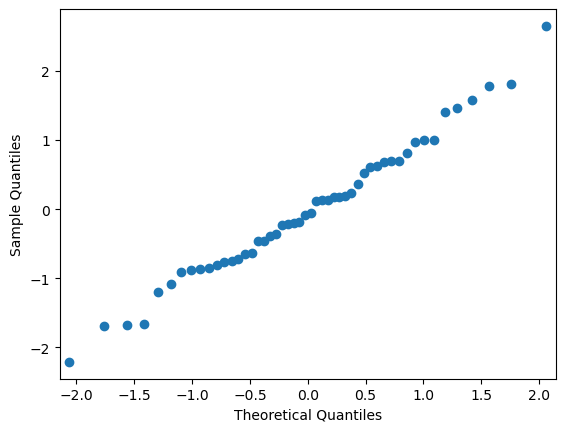

- **Standardisierte Residuen**
  - Punkte folgen der Linie (y = x) bei Normalität.
  - Größe leichter zu bewerten:
    - Absolutwert 2: groß, aber nicht außergewöhnlich.
    - Absolutwert 4: sehr ungewöhnlich.
  - Empfehlung: Standardisierte statt rohe Residuen verwenden.
  - Unterschiede zu rohen Residuen meist nur bei großer Hebelwirkung sichtbar.

### 4.2.2. Ausreißer
### Ausreißer

- **Definition**
  - Datenpunkt, der sich von anderen abhebt.
  - Kann die Datenanpassung beeinflussen.
  - Test unterscheidet echte Ausreißer von großen Residuen.

- **Beispiel**
  - Punkt mit großem Residuum, beeinflusst andere Residuen.
  - Wichtig für die Analyse, da sie die Regressionslinie verzerren können.

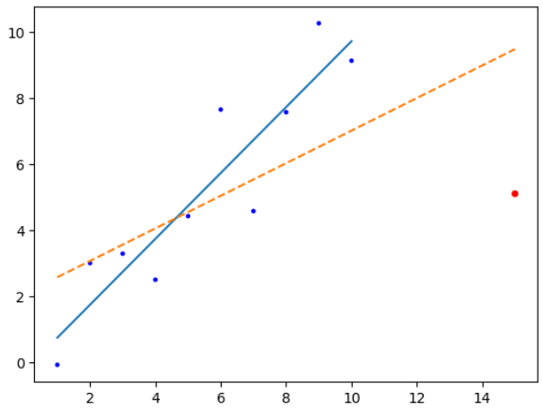

- **Erkennung von Ausreißern**
  - Punkt (i) ausschließen und Schätzungen neu berechnen:
    - ${\hat{y}}_{\left(i\right)}=x_i^\prime{\hat{\beta}}_{\left(i\right)}$
    - Großer Unterschied ${\hat{y}}_{\left(i\right)}-y_i$ zeigt Ausreißer.
  - **Skalierung**
    - Varianz: $\widehat{var}{\left(y_i-{\hat{y}}_{\left(i\right)}\right)}={\hat{\sigma}}_{\left(i\right)}^2\left(1+x_i^\prime\left(X_{\left(i\right)}^\prime X_{\left(i\right)}\right)^{-1}x_i\right)$
    - Studentisierte Residuen: $t_i=\frac{y_i-{\hat{y}}_{\left(i\right)}}{{\hat{\sigma}}_{(i)}\sqrt{1+x_i^\prime\left(X_{\left(i\right)}^\prime X_{\left(i\right)}\right)^{-1}x_i}}$
    - Vereinfachte Berechnung: $t_i=\frac{{\hat{\varepsilon}}_i}{{\hat{\sigma}}_{(i)}\sqrt{1-h_i}}=r_i\ \left(\frac{n-p-1}{n-p-r_i^2}\right)^\frac{1}{2}\ \sim t_{n-p-1}$

- Da $t_i \sim t_{n-p-1}$, können wir einen p-Wert berechnen, um zu prüfen, ob Fall (i) ein Ausreißer ist.
  - Funktioniert gut bei einem vorgewählten Fall.
- Bei (n = 100) und Testen aller Fälle:
  - Erwartung: ca. fünf Ausreißer bei 5% Signifikanzniveau.
- Auch bei explizitem Testen von ein oder zwei großen ($t_i$) Werten:
  - Implizites Testen aller Fälle, um große Residuen zu identifizieren.
- Anpassung des Testniveaus notwendig:
  - Vermeidung zu vieler identifizierter Ausreißer.

- Angenommen, wir möchten einen Test mit Signifikanzniveau ($\alpha$) durchführen.
  - Wahrscheinlichkeit, dass alle Tests akzeptiert werden: ($1 - P(\text{mindestens ein Test lehnt ab}) \approx 1 - n\alpha$).
  - Für ein Gesamt-Signifikanzniveau ($\alpha$) sollten wir für jeden Test ein Niveau ($\alpha/n$) verwenden.
    - Dies wird als Bonferroni-Korrektur bezeichnet.
    - Häufig verwendet, um das Signifikanzniveau bei mehreren Tests anzupassen.
    - Hauptnachteil: konservativ, findet weniger Ausreißer als erwartet.
    - Je größer (n) ist, desto konservativer wird die Korrektur.
  - Die Bonferroni-Korrektur reduziert die Wahrscheinlichkeit von Fehlalarmen (false positives) und kontrolliert das Risiko von Typ-I-Fehlern.

```python=
# In statsmodels, studentized residual is externally studentized residual and got by the get_influence()
stud = pd.Series(diagv.resid_studentized_external, savings.index)
(pd.Series.idxmax(abs(stud)), np.max(abs(stud)))
```

    ('Zambia', 2.8535583382283916)

```python=
# Calculate the critical value: α=0.05, divided by 2 for 2 sided test, n = 50 -> n-p-1=44
abs(sp.stats.t.ppf(0.05/(2*50), 44))
```

    3.525801306486005

- Da 2,85 kleiner als 3,53 ist:
  - Schlussfolgerung: Sambia ist kein Ausreißer.
- Bei einfacher Regression:
  - Kritischer Minimalwert ist 3,51 bei $n = 23$.
  - p-Wert für Ausreißertests nur berechnen, wenn studentisierter Residuum absolut größer als 3,5 ist.

#### Vier Punkte:

- Ausreißer:
  - Zwei oder mehr Ausreißer nebeneinander können sich gegenseitig verstecken.
  - Ein Ausreißer in einem Modell ist möglicherweise kein Ausreißer in einem anderen Modell.
    - Bei Änderung oder Transformation der Variablen muss die Frage der Ausreißer neu untersucht werden.
- Fehlerverteilung:
  - Fehlerverteilung ist nicht immer normal, größere Fehler können gelegentlich auftreten.
    - Beispiel: Aktienkurse ändern sich meist geringfügig, können aber auch signifikant und unerwartet schwanken.
- Größere Datensätze:
  - Einzelne Ausreißer haben weniger Einfluss auf die Gesamtanpassung.
  - Wichtig, Ausreißer zu identifizieren, um wertvolle Erkenntnisse zu gewinnen.
    - Fokus auf Cluster von Ausreißern:
      - Weniger wahrscheinlich zufällig, eher bedeutungsvolle Muster.
      - Identifizierung dieser Cluster kann schwierig sein.

#### Aufgaben bei Ausreißern:

- Datenfehler prüfen:
  - Bei sicherem Fehler, Punkt verwerfen.
- Wissenschaftliche Entdeckungen:
  - Ausreißer können neue Erkenntnisse bringen, z.B. bei Kreditkartenbetrug.
- Punkt ausschließen:
  - Später bei Modelländerung wieder einbeziehen.
- Natürliche Ausreißer:
  - Robuste Regression verwenden.
  - Ausreißer nicht einfach entfernen, sondern Vorhersagemethoden anpassen.
- Automatisches Ausschließen:
  - Gefährlich, sollte vermieden werden.

### 4.2.3. Einflussreiche Beobachtungen

- Einflussreicher Punkt:
  - Entfernen würde die Modellanpassung stark ändern.
  - Kann ein Ausreißer oder hoher Hebel sein.
- Einflussmessung:
  - Subskript (i) zeigt Anpassung ohne Fall i.
  - Änderung der Anpassung messen: ${X}^\prime(\hat{\beta} - \hat{\beta}_{(i)}) = \hat{y} - \hat{y}_{(i)}$
  - Änderung im Koeffizienten $\hat{\beta} - \hat{\beta}_{(i)}$ betrachten.
  - Cook-Statistik:
    - Beliebte Einflussdiagnostik.
    - Reduziert Information auf einen Wert pro Fall.
    - Formel: $D_i = \frac{(\hat{y} - \hat{y}_{(i)})^\prime (\hat{y} - \hat{y}_{(i)})}{p \hat{\sigma}^2} = \frac{1}{p} r_i^2 \frac{h_i}{1 - h_i}$
      - $r_i^2$: Residualeffekt.
      - $\frac{h_i}{1 - h_i}$: Hebel.
      - Kombination führt zu Einfluss.
    - Halb-Normal-Plot von $D_i$ zur Identifikation einflussreicher Beobachtungen.

```python=
cooks = pd.Series(diagv.cooks_distance[0], savings.index)
n=50
ix = np.arange(1,n+1)
halfq = sp.stats.norm.ppf((n+ix)/(2*n+1)),
plt.scatter(halfq, np.sort(cooks));
```

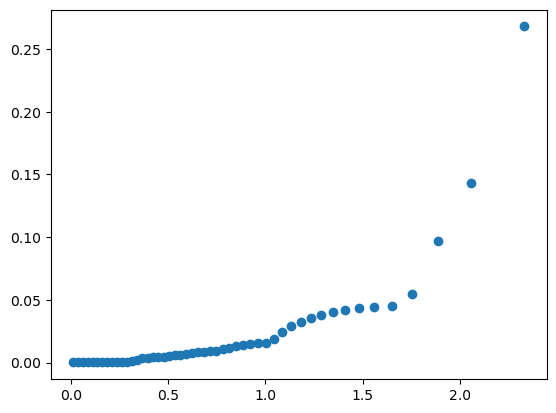

```python=
# The largest five values of Cook statistics
cooks.sort_values().iloc[-5:]
```

    Philippines    0.045221
    Ireland        0.054396
    Zambia         0.096633
    Japan          0.142816
    Libya          0.268070
    dtype: float64

```python=
# Eclude Libya and see how the fit changes
lmodi = smf.ols('sr ~ pop15 + pop75 + dpi + ddpi', savings[cooks < 0.2]).fit()
pd.DataFrame({'with':lmod.params, 'without':lmodi.params})
```

<table class="dataframe">
  <thead>
    <tr style="text-align: right;">
      <th></th>
      <th>with</th>
      <th>without</th>
    </tr>
  </thead>
  <tbody>
    <tr>
      <th>Intercept</th>
      <td>28.566087</td>
      <td>24.524046</td>
    </tr>
    <tr>
      <th>pop15</th>
      <td>-0.461193</td>
      <td>-0.391440</td>
    </tr>
    <tr>
      <th>pop75</th>
      <td>-1.691498</td>
      <td>-1.280867</td>
    </tr>
    <tr>
      <th>dpi</th>
      <td>-0.000337</td>
      <td>-0.000319</td>
    </tr>
    <tr>
      <th>ddpi</th>
      <td>0.409695</td>
      <td>0.610279</td>
    </tr>
  </tbody>
</table>

- Änderungen:
  - Koeffizient für ddpi änderte sich um ca. 50%.
- Sensitivität:
  - Schätzungen sollen nicht so empfindlich auf ein Land reagieren.

```python=
# Extract DFBETAS for pop15. DFBETAS stands for "Difference in Betas." 
# Measure the change in each regression coefficient when an observation is removed from the dataset.
p15d = diagv.dfbetas[:, 1]
diagv.dfbetas.shape
```

    (50, 5)

```python=
# Plot DFBETAS for pop15
plt.scatter(np.arange(1,51), p15d)
plt.axhline(0)
# Annotate Japan and Libya
ix = 22; plt.annotate(savings.index[ix], (ix, p15d[ix]))
ix = 48; plt.annotate(savings.index[ix], (ix, p15d[ix]));
```

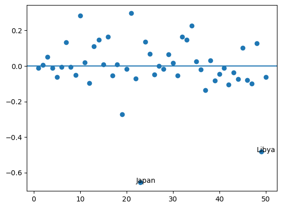

- Änderung des zweiten Parameters (~popI5) bei Ausschluss eines Falls:
  - Japan fällt besonders auf.
  - Prozess für andere Variablen wiederholen.
  - Wirkung des Ausschlusses von Japan untersuchen.

```python=
lmodj = smf.ols('sr ~ pop15 + pop75 + dpi + ddpi', 
    savings.drop(['Japan'])).fit()
lmodj.sumary()
```

               coefs stderr tvalues pvalues
    Intercept 23.940  7.784    3.08  0.0036
    pop15     -0.368  0.154   -2.39  0.0210
    pop75     -0.974  1.155   -0.84  0.4040
    dpi       -0.000  0.001   -0.51  0.6112
    ddpi       0.335  0.198    1.69  0.0987
    n=49 p=5 Residual SD=3.738 R-squared=0.28

- Vergleich mit vollständiger Datenanpassung:
  - Mehrere Änderungen sichtbar.
  - ddpi-Term nicht mehr signifikant.
  - R²-Wert stark gesunken.

## 4.3. Modellstruktur

- Plots der Residuen $\hat{\varepsilon}$ gegen:
  - Vorhergesagte Werte $\hat{y}$
  - Prädiktorvariablen $x_i$
- Nutzen:
  - Überprüfung der Annahmen über Fehler im Modell.
  - Hinweise auf mögliche Transformationen der Variablen zur Verbesserung der Modellstruktur.

- Wir können Diagramme von y gegen jedes $x_i$ erstellen.
- Die Beziehung zwischen einem Prädiktor und der Antwortvariable kann von anderen Prädiktoren beeinflusst werden.
- Um den Effekt eines Prädiktors ($x_i$) auf die Antwortvariable (y) zu isolieren, verwenden wir partielle Regressionsdiagramme:
  - Zuerst sagen wir y mit allen Prädiktoren außer $x_i$ voraus, um die Residuen ($\hat{\delta}$) zu erhalten.
  - Dann regredieren wir $x_i$ auf alle anderen Prädiktoren, um die Residuen ($\hat{\gamma}$) zu erhalten.
  - Das Diagramm wird erstellt, indem $\hat{\delta}$ gegen $\hat{\gamma}$ geplottet wird. So erkennen wir nichtlineare Beziehungen, Ausreißer und einflussreiche Beobachtungen.

- Ein partielles Regressionsdiagramm (Added Variable Plot) hilft, Regressionskoeffizienten zu verstehen.
- Zeigt die Beziehung zwischen einem Prädiktor und der Antwortvariable, nach Entfernen der Effekte anderer Prädiktoren.
- In der multiplen Regression ist es schwierig, die Beziehung zu visualisieren wegen der vielen Prädiktoren.
- Das partielle Regressionsdiagramm vereinfacht dies, indem es sich auf einen Prädiktor konzentriert.
- Es isoliert die Effekte anderer Prädiktoren und zeigt den individuellen Beitrag jedes Prädiktors zur Antwortvariable.

```python=
# Examine the variable pop15
d = smf.ols('sr ~ pop75 + dpi + ddpi', savings).fit().resid
m = smf.ols('pop15 ~ pop75 + dpi + ddpi', savings).fit().resid
plt.scatter(m, d)
plt.xlabel("pop15 residuals"); plt.ylabel("sr residuals")
# Plot a line from the point (-10, -10*beta_pop15) to the point (8, 8*beta_pop15)
plt.plot([-10, 8], [-10*lmod.params.iloc[1], 8*lmod.params.iloc[1]]);
```

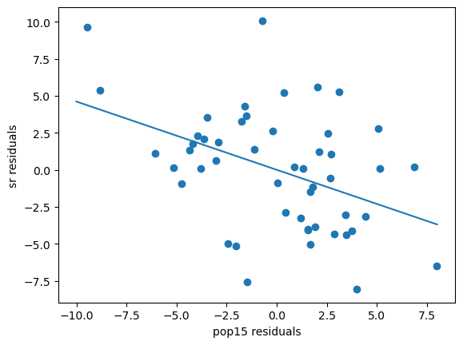

- Die Funktion `np.polyfit(m, d, deg=1)` wird verwendet, um eine Polynomapproximation (lineare Regression in diesem Fall) auf die Datenpunkte (m, d) durchzuführen.
- Hier ist eine detaillierte Aufschlüsselung:
    - `m`: Array der x-Koordinaten (unabhängige Variable).
    - `d`: Array der y-Koordinaten (abhängige Variable).
    - `deg=1`: Grad des zu fitten Polynoms. `deg=1` bedeutet eine lineare Anpassung (gerade Linie).

- Die Funktion gibt die Koeffizienten des Polynoms zurück, beginnend mit dem höchsten Grad.
- Für eine lineare Anpassung werden zwei Koeffizienten zurückgegeben: die Steigung und der Achsenabschnitt.

```python=
np.polyfit(m,d,deg=1), lmod.params.iat[1]
```

    (array([-4.61193147e-01, -3.80967234e-13]), -0.4611931471227622)

- Partielle Residuenplots sind eine Alternative zu Added Variable Plots.
  - $y-\sum_{j\neq i}{x_j{\hat{\beta}}_j}=\hat{y}+\hat{\varepsilon}-\sum_{j\neq i}{x_j{\hat{\beta}}_j}=x_i{\hat{\beta}}_i+\hat{\varepsilon}$
  - Der partielle Residuenplot ist $x_i{\hat{\beta}}_i+\hat{\varepsilon}$ gegen $x_i$.
  - Die Steigung des Plots ist ${\hat{\beta}}_i$.
  - Partielle Residuenplots eignen sich besser zur Erkennung von Nichtlinearitäten, Added Variable Plots besser zur Erkennung von Ausreißern/Einflüssen.
  - Manchmal sind die partiellen Residuen zentriert, was nur die Skala der vertikalen Achse verändert.

```python
pr = lmod.resid + savings.pop15*lmod.params.iat[1]
plt.scatter(savings.pop15, pr)
plt.xlabel("pop15"); plt.ylabel("partial residuals")
# Plot a line from the point (20, 20*beta_pop15) to the point (50, 50*beta_pop15)
plt.plot([20,50], [20*lmod.params.iat[1], 50*lmod.params.iat[1]]);
```

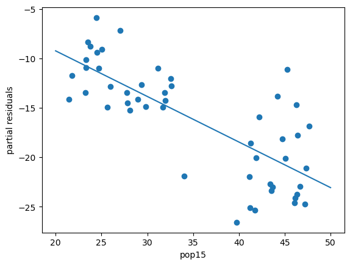

- Das Diagramm zeigt zwei Gruppen.
- Dies deutet auf unterschiedliche Beziehungen in diesen Gruppen hin.

```python=
smf.ols('sr ~ pop15 + pop75 + dpi + ddpi', savings[savings.pop15 > 35]).fit().sumary()
```

               coefs stderr tvalues pvalues
    Intercept -2.434 21.155   -0.12  0.9097
    pop15      0.274  0.439    0.62  0.5408
    pop75     -3.548  3.033   -1.17  0.2573
    dpi        0.000  0.005    0.08  0.9339
    ddpi       0.395  0.290    1.36  0.1896
    n=23 p=5 Residual SD=4.454 R-squared=0.16


```python=
smf.ols('sr ~ pop15 + pop75 + dpi + ddpi', savings[savings.pop15 < 35]).fit().sumary()
```

               coefs stderr tvalues pvalues
    Intercept 23.962  8.084    2.96  0.0072
    pop15     -0.386  0.195   -1.98  0.0609
    pop75     -1.328  0.926   -1.43  0.1657
    dpi       -0.000  0.001   -0.63  0.5326
    ddpi       0.884  0.295    2.99  0.0067
    
    n=27 p=5 Residual SD=2.772 R-squared=0.51

- In unterentwickelten Ländern (pop15>35%) gibt es keinen Zusammenhang zwischen den Prädiktoren und der Antwortvariable.
- In entwickelten Ländern (pop15<35%) gibt es einen starken Zusammenhang, besonders mit dem Prädiktor Wachstum und dem Anteil der Bevölkerung unter 15.
- Der Effekt ist weniger auffällig, da wir den Bereich des Prädiktors eingeschränkt haben.
- Die grafische Analyse zeigte eine Beziehung, die eine rein numerische Analyse übersehen könnte.
- Zusätzliche Dimensionen in Diagnoseplots durch Farbe, Symbole oder Größe können hilfreich sein, oder wir verwenden facettierte Plots.

```python=
savings.head(3)
```

<table class="dataframe">
  <thead>
    <tr style="text-align: right;">
      <th></th>
      <th>sr</th>
      <th>pop15</th>
      <th>pop75</th>
      <th>dpi</th>
      <th>ddpi</th>
    </tr>
  </thead>
  <tbody>
    <tr>
      <th>Australia</th>
      <td>11.43</td>
      <td>29.35</td>
      <td>2.87</td>
      <td>2329.68</td>
      <td>2.87</td>
    </tr>
    <tr>
      <th>Austria</th>
      <td>12.07</td>
      <td>23.32</td>
      <td>4.41</td>
      <td>1507.99</td>
      <td>3.93</td>
    </tr>
    <tr>
      <th>Belgium</th>
      <td>13.17</td>
      <td>23.80</td>
      <td>4.43</td>
      <td>2108.47</td>
      <td>3.82</td>
    </tr>
  </tbody>
</table>

```python=
savings['age'] = np.where(savings.pop15 > 35, 'young', 'old')
sns.lmplot(x='ddpi', y='sr', data=savings, hue='age', facet_kws={"legend_out": False});
```

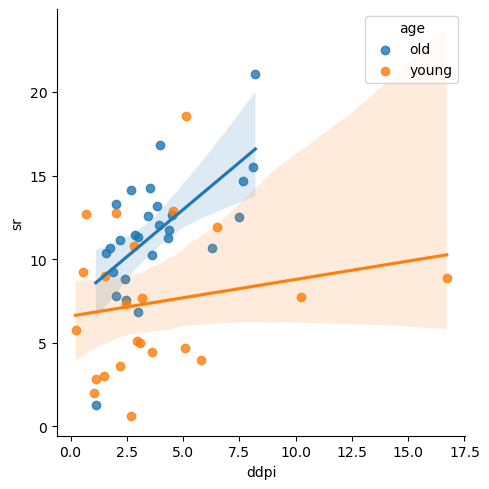

- `sns.lmplot`: Seaborn-Funktion für lineare Regression.
- `x='ddpi'`: Spalte ‘ddpi’ für die x-Achse.
- `y='sr'`: Spalte ‘sr’ für die y-Achse.
- `data=savings`: DataFrame `savings` für das Diagramm.
- `hue='age'`: Färbt Datenpunkte nach ‘age’ (jung, alt).
- `facet_kws={"legend_out": False}`: Legende im Diagramm behalten.

```python=
sns.lmplot(x='ddpi', y='sr', data=savings, col='age');
```

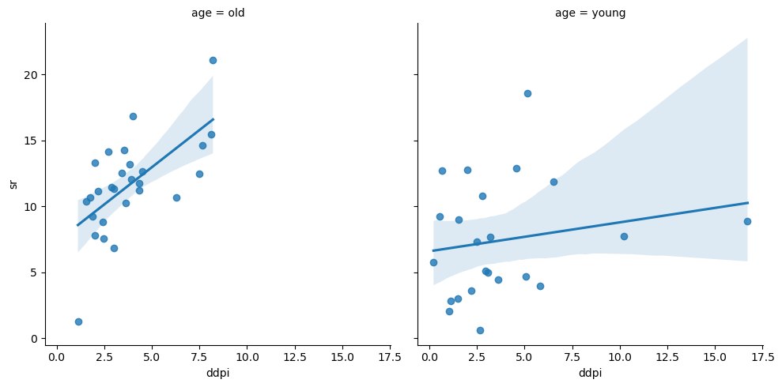

- Die Plots zeigen zwei Wege, die Statusvariable anhand des Anteils der Bevölkerung unter 15 zu unterscheiden.
- Die zweite Plotreihe ist effektiver.
- Wir haben eine Regressionslinie mit 95% Konfidenzintervallen hinzugefügt, um die Unterschiede zwischen den Gruppen zu zeigen.
- Höherdimensionale Plots helfen, Strukturen zu erkennen, die in 2D nicht sichtbar sind.
- Diese Plots sind meist interaktiv und erfordern Ausprobieren.
- 3D-Plots können durch Farbe, Punktgröße und Rotation erstellt werden.
- Mehrere Plots können verlinkt werden, um Punkte in einem Plot in einem anderen hervorzuheben.
- Diese Tools sehen beeindruckend aus, sind aber praktisch oft schwer nutzbar und schwer zu drucken.

## 4.4. Diskussion

- Nach Wichtigkeit der Effekte sortiert:
  - **Modellform:** Korrekte Definition der Variablenbeziehungen ist essentiell. Falsche Definition führt zu fehlerhaften Vorhersagen und irreführenden Interpretationen.
  - **Fehlerabhängigkeit:** Starke Abhängigkeit der Fehler reduziert die Informationsmenge der Daten. Dies kann zur fälschlichen Hinzufügung systematischer Komponenten führen. Schwer zu erkennen, außer bei zeitlichen Daten.
  - **Nichtkonstante Varianz:** Kann zu ungenauen Schlussfolgerungen führen, vor allem bei der Unsicherheitsschätzung. Bei geringer Verletzung ist die Zuverlässigkeit der Schlussfolgerungen meist nicht stark beeinträchtigt.
  - **Normalverteilung:** Weniger wichtig. Bei großen Datensätzen sind die Schlussfolgerungen robust, auch ohne Normalverteilung, dank des zentralen Grenzwertsatzes. Bei kleinen Stichproben oder extrem abnormalen Fehlern ist diese Annahme kritischer.

# 5. Skalierungsänderungen

- Manchmal müssen wir die Skala von Variablen ändern, um Einheiten zu konvertieren oder sehr große/kleine Werte anzupassen.
- Skalierungsänderungen verbessern die numerische Stabilität und verhindern Berechnungsfehler.
- Reskalierung beeinflusst nicht statistische Tests wie t-Tests, F-Tests, Varianz und R-Quadrat.
- Skalierung zu Standardwerten (Mittelwert 0, Varianz 1) vereinfacht Vergleiche und vermeidet numerische Probleme.
- Bei Reskalierung von $x_i$ als $ \frac{x_i + a}{b} $ bleiben t-Tests, F-Tests, $ \sigma^2 $ und $ R^2 $ unverändert, aber die geschätzten Koeffizienten $ \hat{\beta}_i $ werden skaliert.
- Reskalierung von $y$ lässt t-Tests, F-Tests und $ R^2 $ unverändert, aber die geschätzten Koeffizienten $ \hat{\beta} $ und die geschätzte Standardabweichung $ \hat{\sigma} $ werden skaliert.
- Standardisierung von Variablen (Mittelwert 0, Varianz 1) hat Vorteile:
  - **Vergleichbare Skala:** Alle Variablen sind auf gleicher Skala, was Vergleiche erleichtert.
  - **Teilkorrelation:** Regressionskoeffizienten zwischen -1 und 1 zeigen Stärke und Richtung der Beziehungen.
  - **Numerische Stabilität:** Zentrieren vermeidet Probleme durch unterschiedliche Skalen, sorgt für stabile Berechnungen.
  - **Standardinterpretation:** Koeffizienten zeigen den Effekt einer Standardabweichung des Prädiktors auf die Antwortvariable.

```python=
# Reload the data again
Figures/savings_sclDF = faraway.datasets.savings.load()
# Run a regression
lmod = smf.ols('sr ~ pop15 + pop75 + dpi + ddpi', Figures/savings_sclDF).fit()
lmod.sumary()
```

               coefs stderr tvalues pvalues
    Intercept 28.566  7.355    3.88  0.0003
    pop15     -0.461  0.145   -3.19  0.0026
    pop75     -1.691  1.084   -1.56  0.1255
    dpi       -0.000  0.001   -0.36  0.7192
    ddpi       0.410  0.196    2.09  0.0425
    n=50 p=5 Residual SD=3.803 R-squared=0.34

```python=
# Change the scale
lmod = smf.ols('sr ~ pop15 + pop75 + I(dpi/1000) + ddpi', Figures/savings_sclDF).fit()
lmod.sumary()
```

                   coefs stderr tvalues pvalues
    Intercept     28.566  7.355    3.88  0.0003
    pop15         -0.461  0.145   -3.19  0.0026
    pop75         -1.691  1.084   -1.56  0.1255
    I(dpi / 1000) -0.337  0.931   -0.36  0.7192
    ddpi           0.410  0.196    2.09  0.0425
    n=50 p=5 Residual SD=3.803 R-squared=0.34

```python=
# Standardization
scsav = Figures/savings_sclDF.apply(sp.stats.zscore)
lmod = smf.ols('sr ~ pop15 + pop75 + dpi + ddpi', scsav).fit()
lmod.sumary()
```

               coefs stderr tvalues pvalues
    Intercept  0.000  0.121    0.00  1.0000
    pop15     -0.942  0.295   -3.19  0.0026
    pop75     -0.487  0.312   -1.56  0.1255
    dpi       -0.075  0.206   -0.36  0.7192
    ddpi       0.262  0.126    2.09  0.0425
    
    n=50 p=5 Residual SD=0.857 R-squared=0.34


- Wenn die Prädiktoren vergleichbare Skalen haben, ist es hilfreich, einen Plot der Schätzungen mit Konfidenzintervallen zu erstellen.

```python=
edf = pd.concat([lmod.params, lmod.conf_int()],axis=1).iloc[1:,]
edf.columns = ['estimate','lb','ub']
npreds = edf.shape[0]
fig, ax = plt.subplots()
ax.scatter(edf.estimate,np.arange(npreds))
for i in range(npreds):
    ax.plot([edf.lb.iat[i], edf.ub.iat[i]], [i, i])
ax.set_yticks(np.arange(npreds))
ax.set_yticklabels(edf.index)
ax.axvline(0);
```

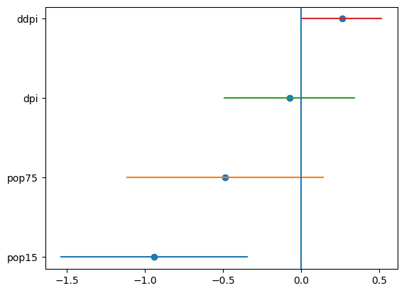

- Bei binären Prädiktoren ist die Skalierung anders.
- Ein binärer Prädiktor (0 und 1, gleiche Wahrscheinlichkeit) hat eine Standardabweichung von 0,5.
- Kontinuierliche Prädiktoren sollten daher mit zwei Standardabweichungen skaliert werden.
- Alternativ kann man die Kodierung -1/+1 für den binären Prädiktor verwenden, um die Standard-Skalierung für kontinuierliche Prädiktoren zu ermöglichen.

```python=
# Create a age column
Figures/savings_sclDF['age'] = np.where(Figures/savings_sclDF.pop15 > 35, 0, 1)
# younger countries are coded as 0 and older countries as 1
Figures/savings_sclDF['dpis'] = sp.stats.zscore(Figures/savings_sclDF.dpi)/2
Figures/savings_sclDF['ddpis'] = sp.stats.zscore(Figures/savings_sclDF.ddpi)/2
smf.ols('sr ~ age + dpis + ddpis', Figures/savings_sclDF).fit().sumary()
```

               coefs stderr tvalues pvalues
    Intercept  6.818  1.011    6.75  0.0000
    age        5.284  1.585    3.33  0.0017
    dpis      -1.549  1.593   -0.97  0.3361
    ddpis      2.443  1.097    2.23  0.0309
    n=50 p=4 Residual SD=3.800 R-squared=0.32

- Interpretation der Koeffizienten ist einfacher:
  - Ältere Länder haben eine 5,28% höhere Sparquote als jüngere (Unterschied von zwei Standardabweichungen).
  - Zwei Standardabweichungen in ddpi entsprechen einer Einheit auf der neuen Skala.
  - Länder mit hoher Wachstumsrate haben typischerweise eine 2,47% höhere Sparquote als solche mit niedriger Wachstumsrate.
  - ddpi ist eine kontinuierliche Variable, diese Interpretation dient dem Verständnis.

# 7. Transformation

- Log-Transformation der Antwortvariable:
  - $\log{\hat{y}}={\hat{\beta}}_0+{\hat{\beta}}_1x_1+\ldots+{\hat{\beta}}_px_p$
  - $\hat{y}=e^{{\hat{\beta}}_0}e^{{\hat{\beta}}_1x_1}\ldots e^{{\hat{\beta}}_px_p}$
  - Erhöhung von $x_1$ um eins multipliziert die vorhergesagte Antwort um $e^{\hat{\beta}_1}$.
  - Bei kleinen $x$ gilt $\log(1 + x) \approx x$.
  - Beispiel: $\beta_1 = 0.09$ bedeutet, Erhöhung von $x_1$ um eins erhöht $\log(y)$ um 0.09, oder y um 9%.

- Box-Cox-Methode transformiert positive Antworten $y$ zu $g_\lambda(y)$:
  - $g_\lambda(y) = \begin{cases} \frac{y^\lambda - 1}{\lambda}, & \lambda \neq 0 \\ \log{y}, & \lambda = 0 \end{cases}$
  - Für $y > 0$ ändert sich $g_\lambda(y)$ gleichmäßig mit $\lambda$.
  - Optimales $\lambda$ wird durch Maximum-Likelihood bestimmt, bei dem Modellfehler normalverteilt sind:
    - $L(\lambda) = -\frac{n}{2} \log{\left(\frac{RSS_\lambda}{n}\right)} + (\lambda - 1) \sum \log{y_i}$
      - RSS$_\lambda$ ist die Residuenquadratsumme für $g_\lambda(y)$.
      - Beste $\hat{\lambda}$ wird numerisch maximiert.
  - Für Vorhersagen kann $y^\lambda$ als Antwort verwendet werden.
  - $\frac{y^\lambda - 1}{\lambda}$ sorgt für glatten Übergang zu $\log{y}$ bei $\lambda \to 0$.
  - Für Verständlichkeit kann $\lambda$ gerundet werden, z.B. $\hat{\lambda} = 0.46$ zu $\lambda = 0.5$ für $\sqrt{y}$.

- Transformation der Antwortvariable sollte nur bei Notwendigkeit erfolgen.
- Überprüfung durch Konstruktion eines Konfidenzintervalls für $\lambda$:
  - $100(1-\alpha)\%$ Konfidenzintervall für $\lambda$:
    - $\left\{\lambda:L\left(\lambda\right)>L\left(\hat{\lambda}\right)-1/2\chi_{1,1-\alpha}^2\right\}$
  - Intervall basiert auf Likelihood-Ratio-Test für $H_0: \lambda = \lambda_0$.
  - Teststatistik: $2\left(L\left(\hat{\lambda}\right) - L\left(\lambda_0\right)\right)$ folgt $\chi_1^2$-Verteilung.
  - Konfidenzintervall zeigt, wie stark $\lambda$ für bessere Interpretierbarkeit gerundet werden kann.


```python=
# Extracts the exogenous variables matrix X
X = lmod.model.wexog
# Setting Up Variables for Box-Cox Transformation
n = savings.shape[0] # number of observations in the dataset
sumlogy = np.sum(np.log(savings.sr)) # sum of log of sr
lam = np.linspace(0.5, 1.5, 100) # array of 100 lambda values ranging from 0.5 to 1.5
llk = np.empty(100) # empty array to store log-likelihood values
# Calculating Log-Likelihood for Each Lambda
for i in range(0, 100):
    lmod = sm.OLS(sp.stats.boxcox(savings.sr, lam[i]), X).fit()
    llk[i] = -(n/2)*np.log(lmod.ssr/n) + (lam[i]-1)*sumlogy
# Plotting the Log-Likelihood Values
fig, ax = plt.subplots()
ax.plot(lam, llk)
ax.set_xlabel('$\lambda$'); ax.set_ylabel('log likelihood')
# Highlighting the Maximum Log-Likelihood
maxi = llk.argmax()
ax.vlines(lam[maxi], ymin=min(llk), ymax=max(llk), linestyle='dashed')
# Calculates the cutoff for the 95% confidence interval
cicut = max(llk) - sp.stats.chi2.ppf(0.95, 1) / 2
# Identifies the range of lambda values within this confidence interval
rlam = lam[llk > cicut]
# Draws horizontal and vertical dashed lines to indicate the confidence interval on the plot.
ax.hlines(cicut, xmin=rlam[0], xmax=rlam[-1], linestyle='dashed')
ax.vlines([rlam[0], rlam[-1]], ymin=min(llk), ymax=cicut, linestyle='dashed');
```

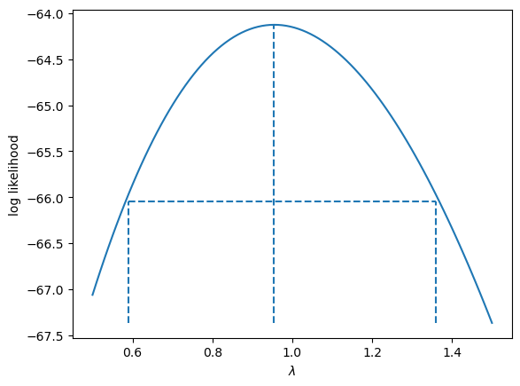

- Berechnungsbereich: [0.5, 1.5]
- Ein größerer Bereich könnte notwendig sein, um das Maximum und das Konfidenzintervall zu erfassen.
- Bereich basierte auf vorherigen Tests.
- Konfidenzintervall für $\lambda$: ungefähr 0.6 bis 1.4, daher keine starke Notwendigkeit zur Transformation.

# 8. Knickpunkt-Regression

- Manchmal brauchen Daten verschiedene lineare Regressionsmodelle.
- Beispiel: Spardaten zeigen zwei Gruppen.
- Mit dem Prädiktor ‘pop15’ können wir zwei Modelle erstellen:
  - ‘pop15’ über 35%
  - ‘pop15’ unter 35%

```python=
# Fit linear models for two segments of the data
lmod1 = smf.ols('sr ~ pop15', savings[savings.pop15 < 35]).fit()
lmod2 = smf.ols('sr ~ pop15', savings[savings.pop15 > 35]).fit()
# Create scatter plot of the data
plt.scatter(savings.pop15, savings.sr)
plt.xlabel('Population under 15'); plt.ylabel('Savings rate')
plt.axvline(35, linestyle='dashed')
# Plot the first segment of the regression line
plt.plot([20, 35], [lmod1.params.iat[0] + lmod1.params.iat[1] * 20,
                    lmod1.params.iat[0] + lmod1.params.iat[1] * 35], 'k-')
# Plot the second segment of the regression line
plt.plot([35, 48], [lmod2.params.iat[0] + lmod2.params.iat[1] * 35,
                    lmod2.params.iat[0] + lmod2.params.iat[1] * 48], 'k-');
```

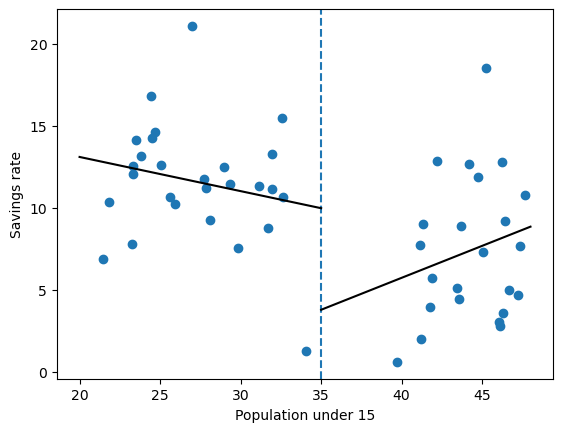

- Problem bei separaten Modellen: keine Verbindung am Trennpunkt.
- Für einen fließenden Übergang verwenden wir Knickpunkt-Regression:
  - Zwei neue Variablen:
    - $B_l(x) = \begin{cases} 
        c - x & \text{wenn } x < c \\ 
        0 & \text{ansonsten} 
      \end{cases}$    
    - $B_r(x) = \begin{cases} 
        x - c & \text{wenn } x > c \\ 
        0 & \text{ansonsten} 
      \end{cases}$

- Punkt ‘c’ teilt die Daten in zwei Gruppen und erzeugt die Variablen $B_l$ und $B_r$.
- Diese Variablen bilden eine erste Ordnung Spline-Basis mit einem Knoten bei ‘c’, was eine bessere Anpassung ermöglicht.
- Diese Variablen werden oft als Hockeyschläger-Funktionen bezeichnet.
- Das Modell hat die Form $y=\beta_0+\beta_1B_l(x)+\beta_2B_r(x)+\varepsilon$ und wird durch reguläre Regressionsmethoden angepasst.
- Die beiden Segmente des Modells treffen sich bei Punkt ‘c’, was Kontinuität gewährleistet.
- Im Gegensatz zum vorherigen Ansatz verwendet dieses Modell nur drei Parameter, indem es die Glätte bei Punkt ‘c’ sicherstellt.
- Der Achsenabschnitt dieses Modells ist der Wert des Ergebnisses, wo die beiden Teile sich treffen.

```python=
# Define helper functions for piecewise linear terms
def lhs(x, c):
    return np.where(x < c, c - x, 0)
def rhs(x, c):
    return np.where(x < c, 0, x - c)
# Fit the linear model using the piecewise terms
lmod = smf.ols('sr ~ lhs(pop15,35) + rhs(pop15,35)', savings).fit()
# Generate predictions
x = np.arange(20, 49) # array of values from 20 to 48
# Computes predicted savings rate (py) using the fitted model parameters
# and the lhs and rhs functions.
py = lmod.params.iat[0] + lmod.params.iat[1] * lhs(x, 35) + lmod.params.iat[2] * rhs(x, 35)
# Plot the piecewise linear regression line
plt.plot(x, py, linestyle='dotted')
# Create scatter plot of the data
plt.scatter(savings.pop15, savings.sr)
plt.xlabel('Population under 15'); plt.ylabel('Savings rate')
# Add a vertical dashed line at pop15 = 35
plt.axvline(35, linestyle='dashed');
```
    
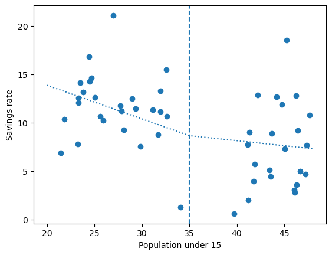

- Welches Modell ist besser?
  - Bei hohen ‘pop15’-Werten ändert sich die Steigung durch Glättung.
  - Aufgrund der Unterschiede zwischen den Gruppen und wenigen Ländern in der Mitte ist Glättung vielleicht nicht nötig.
- Flexibleres Modell durch Hinzufügen weiterer Knickpunkte (Knotenpunkte).
- Ansatz: Segmentierte Regression oder Knickpunkt-Regression.
  - Knotenpunkte können sich ändern, um komplexe Datenmuster besser anzupassen.